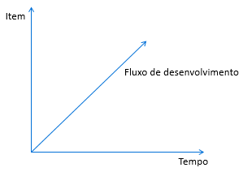
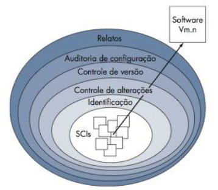
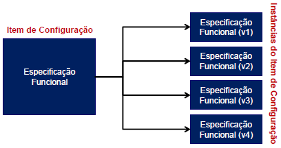

13. Aula 11
Assunto
Prática: Controle de versão com o Git
Antes de praticar...
Visão geral da gerência de configuração de software (GCS):
O problema da comunicação (falhas, quebras, inexistência...)
O problema dos "dados compartilhados"
A GCS é uma disciplina para o controle da evolução de sistemas de software
Refinamentos (ou iterações) sucessivos nos artefatos que são produzidos ao longo do desenvolvimento do software
baseline = item de configuração (artefatos) que foi formalmente aprovado – estão aptos para seguir para as próximas etapas de desenvolvimento
release = item de configuração (ou vários) que foi formalmente aprovado – será entregue ao cliente

Modelos de processos

Pressman (2011)

Item de configuração

Uma agregação de hardware, software ou ambos que é designado para gerência de configuração e tratada como uma entidade única no processo de gerência de configuração (IEEE 610)
É o menor item de controle em um processo de GCS
Qualquer tipo de arquivo
O executável de uma aplicação
Qualquer documentação (requisitos, modelos, planos....)
Código fonte
Entre outros
Um item de configuração está sujeito à mudanças e essas devem obedecer às políticas estabelecidas.
A cada novo ciclo, novas versões de um ou mais itens são criadas.

Arquitetura Git

Fonte

Git tutorial

Acesse em https://github.com/uodatascience/git-tutorial

Comandos mais usados

Comando

Descriçao

git init

# inicializa o repositório

git add [file] # arquivo único

git add . # todos os arquivos

# adicionar arquivos

git rm

# remove o rastreamento de arquivos

git commit -m "[message text]"

# faz um snapshot do repositório

git clone [repo address]

# copia o repositório existente

git pull

# obtém a versão mais recente do repositório remoto

git fetch

# verifica a versão mais recente do repositório remoto sem mesclar com seu repositório local

git push

# envia as alterações para o repositório remoto

git log

# ver histórico

git diff

# verifica as alterações feitas nos arquivos de um repositório

git checkout -b [name of new branch]

# cria uma nova branch (ramo)

git checkout

# troca de branches

git config --global --list

# verifica as configurações

//////////////////////////////////////////////////////////////////////////////////////////////////////////////////////////////////////////////////////////////////////////////
Crie um projeto baseado no jogo Torre de Hanói com o parâmetro de número de disco e com a saída mostrar a quantidade de movimentos a partir da quantidade de discos informada.

Crie testes unitários para cada método do projeto Torre de Hanói.

